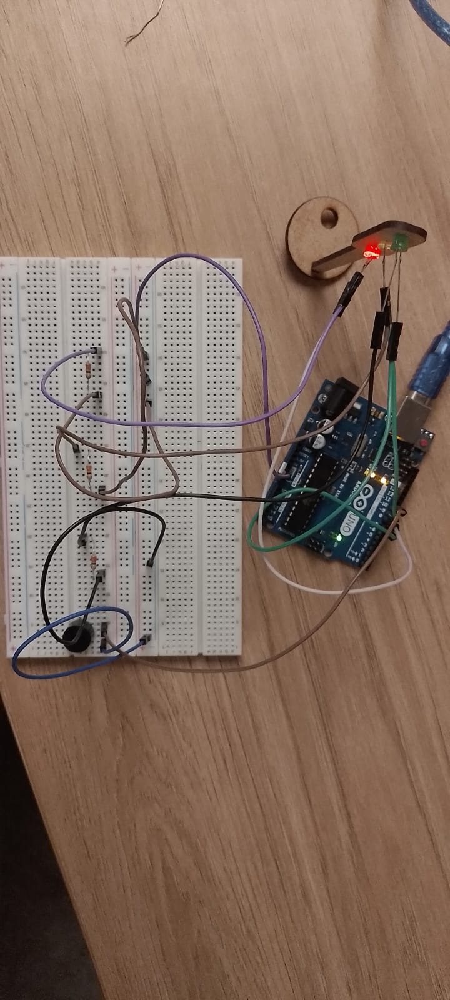

# Semafóro Offline

## Vídeo de funcionamento

&emsp; O Vídeo demonstrando o funcionamento do semáforo está disponível no seguinte link: [Vídeo no youtube](https://www.youtube.com/shorts/bFyUrQ8bXbk)

## Como montar?

&emsp; Para montar o circuito deve-se utilizar um arduino uno junto com 3 LEDs e 3 resistores de 330 ohms. Para realizar o circuito siga os seguintes passos:

- Conecte o arduino uno no computador e envie o código ao microcontrolador, disponível em [src.ino](src.ino).
- Monte o circuito, dedicando a porta 7 para o led verde, a porta 9 para o amarelo e a porta 8 para o vermelho.
- Depois coloque um resistor de 330 ohms em série para cada um dos leds.

&emsp; De acordo com a seguinte imagem:

## Componentes utilizados

| Nome do componente | Quantidade | Preço/Unidade | Preço total |
| - | - | - | - |
| Led Difuso 3mm  | 3 | 0,14 reais | 0,42 reais
| Arduino Uno | 1 | 16,57 reais | 16,57 reais
| Protoboard 900| 1 | 10,97 reais | 10,97 reais |
| Resistor de 330 ohms | 3 | 0,07 reais |0,21 reais 

### Avaliação dos Pares

#### Avaliador: Yuri Lessa Boczar

|Critério|	Contempla (Pontos)|	Contempla Parcialmente (Pontos)	|Não Contempla (Pontos)	|Observações do Avaliador|
|-|-|-|-|-|
|Montagem física com cores corretas, boa disposição dos fios e uso adequado de resistores	|Até 3	|Até 1,5	|0 | 3, muito bom com resistores de 330ohms e cores certas|	
|Temporização adequada conforme tempos medidos com auxílio de algum instrumento externo	|Até 3	|Até 1,5	|0 |3 tempo correto, 6, 4 e 2 segundos |	
|Código implementa corretamente as fases do semáforo e estrutura do código (variáveis representativas e comentários) |	Até 3|	Até 1,5 |	0 | 3, sim, todo o padrao presente|	
|Ir além: Implementou um componente de extra, fez com millis() ao invés do delay() e/ou usou ponteiros no código |	Até 1 |	Até 0,5 |	0 | 1, ficou top, levou o conceito do milis la em cima|	
| | | | |Pontuação Total: 10|

#### Avaliador: Reimar Coelho Ferreira Filho

|Critério|	Contempla (Pontos)|	Contempla Parcialmente (Pontos)	|Não Contempla (Pontos)	|Observações do Avaliador|
|-|-|-|-|-|
|Montagem física com cores corretas, boa disposição dos fios e uso adequado de resistores	|Até 3	|Até 1,5	|0 | 3, fez tudo certo |	
|Temporização adequada conforme tempos medidos com auxílio de algum instrumento externo	|Até 3	|Até 1,5	|0 | 3, tempo correto |	
|Código implementa corretamente as fases do semáforo e estrutura do código (variáveis representativas e comentários) |	Até 3|	Até 1,5 |	0 | 3, ficou legal |	
|Ir além: Implementou um componente de extra, fez com millis() ao invés do delay() e/ou usou ponteiros no código |	Até 1 |	Até 0,5 |	0 | 0.5 nenhuma inovação mas usuou o milis de maneira correta |	
| | | | |Pontuação Total: 9.5 |

#### Avaliador: Breno Farias Gomes da Silva

|Critério|	Contempla (Pontos)|	Contempla Parcialmente (Pontos)	|Não Contempla (Pontos)	|Observações do Avaliador|
|-|-|-|-|-|
|Montagem física com cores corretas, boa disposição dos fios e uso adequado de resistores	|Até 3	|Até 1,5	|0 |3, ficou legal|	
|Temporização adequada conforme tempos medidos com auxílio de algum instrumento externo	|Até 3	|Até 1,5	|0 |3, tempos nos padrões|	
|Código implementa corretamente as fases do semáforo e estrutura do código (variáveis representativas e comentários) |	Até 3|	Até 1,5 |	0 |3, códgio organizado |	
|Ir além: Implementou um componente de extra, fez com millis() ao invés do delay() e/ou usou ponteiros no código |	Até 1 |	Até 0,5 |	0 |1, aplicou o millis|	
| | | | |Pontuação Total|10